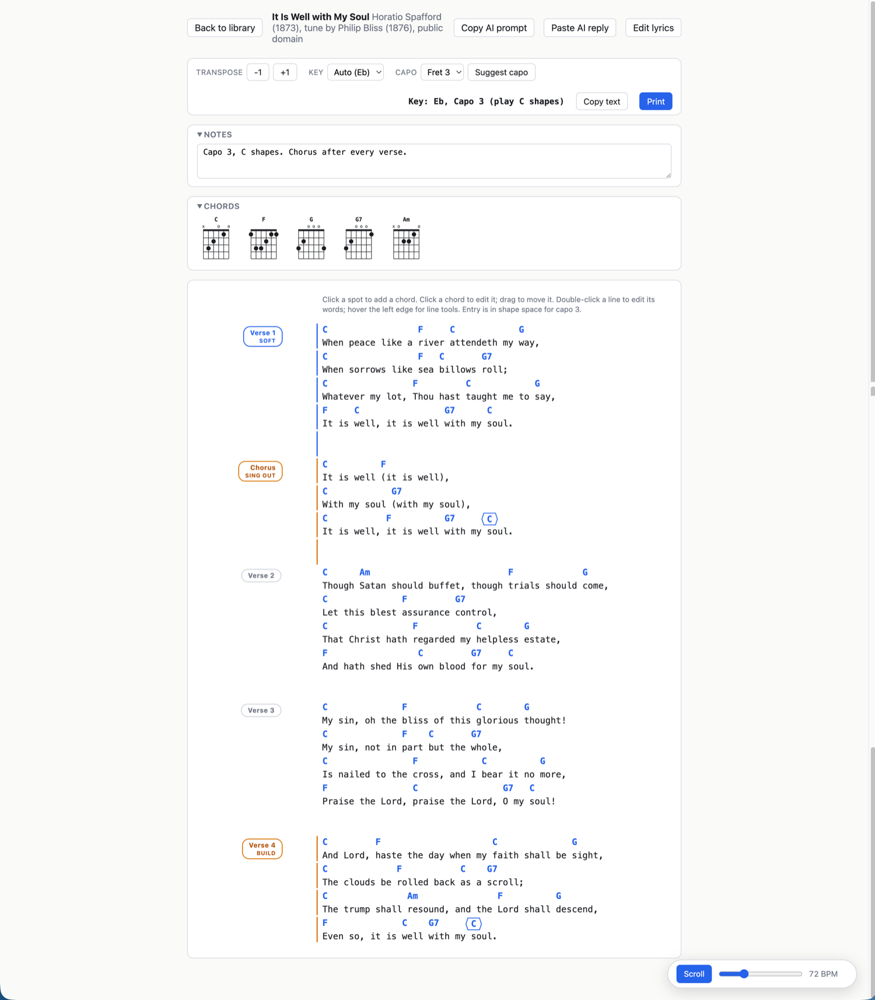

# chordsheet

A personal tool for making play-along guitar chord sheets. Paste lyrics you have, place chord symbols above the exact syllables, transpose or capo them to the shapes you like, and print a clean monospace sheet.

Built to route around a real annoyance: asking an AI to lay out a chord-over-lyrics sheet trips copyright refusals because of the lyric text. Here, you supply the lyrics and control every placement. When AI helps, it only ever emits chord names and positions anchored to your own pasted text (see docs/AI-PLACEMENT.md), never lyric content.



The editor with one of the public domain demo songs. The song is stored in Eb, capo 3 displays the C shapes you actually play, and every chord sits over the exact character it lands on.

## How it was built

Built with Claude Code in a plan-first loop. The first commit is a conventions file and a design doc, not code. Everything after that is an issue, a commit that closes it, and a test wherever the logic is testable. 47 commits, 44 issues, 248 tests across 17 files. The first 29 commits and 31 issues landed in twelve days, August 5 to 16, 2026, from a one-paragraph idea to weekly rehearsal use. BUILDLOG.md has the day-by-day account.

The agents wrote nearly all of the code: the scaffold, the chord engine, the placement editor, the AI round-trip kit, the print path, and the test suites. Eight phases were generated in 27 minutes on the first afternoon, which is the cheap part. The eleven days after that, 23 issues of real use breaking real assumptions, are what turned the skeleton into a tool.

What I decided or corrected myself:

- **The constraint that set the architecture.** The refusal problem came first and the design followed from it. The AI never receives or emits lyrics. It returns chord symbols, line indices, and short anchor substrings quoted from my own pasted text, and the tool resolves those anchors to columns itself, because models miscount character offsets but quote substrings reliably (#5, DESIGN.md).
- **A design overruled the same hour it shipped.** Section dynamics marks landed with tinted section backgrounds (#28). On a music stand it was too busy to read at a glance. The replacement is quieter: tag pills, a print sidebar, a thin edge bar, and tacet sections shrunk to about two thirds size so they get out of the way while staying followable (#29).
- **A migration scan that reported clean and was not.** The pass that promoted section labels missed labels carrying inline notes. I caught the misses by eye in the files, and the fix then went across every song (#31).
- **Fix one song, then audit the library.** Chord rows imported as lyric text were invisible to transpose and capo. Repairing the song in front of me would have left the rest silently broken, so the fix is a bar-notation-aware parser plus an audit pass over every file (#24).
- **A workaround that had to be universal.** Brave disables the File System Access API, so folder save did nothing there. The response is both Brave-specific guidance and a single-file backup that works in any browser (#20).
- **Ideas that stayed issues.** The multi-user buildout was filed on day one and deferred on the spot (#9). The arrangement timeline was written down with "just capture the idea for now, not sure on it yet" and is still open (#22).

## Current shortcomings

Everything here is confirmed by running the app or reading the tree, not guessed at.

- **Folder save is Chromium only.** "Save all to folder" needs the File System Access API. Chrome and Edge have it. Brave ships Chromium but disables it, so it needs a flag (the app detects Brave and says which one). Safari and Firefox have no folder save at all, only "Download backup".
- **No mobile layout.** At 390 CSS pixels the library page overflows sideways and controls run off the edge. The only media query in the stylesheet is the print one.
- **No undo.** Deleting a chord takes effect on the click. Deleting a lyric line asks only when the line holds chords. Song and set deletion ask once. Nothing is recoverable after that except from a backup file.
- **Unusual chords get approximate shapes.** Voicings come from a curated table plus movable barre forms, and anything outside that walks a simplification ladder to the nearest reasonable shape. The diagram tooltip names the substitution when it happens, so you can see when the grid is not literally the chord.
- **One browser holds the working copy.** Songs live in that browser's localStorage. Nothing syncs between browsers or machines. Moving a library means folder save, "Download backup", or per-song export and import.
- **Tests stop at the UI boundary.** 248 tests across 17 files cover the engine (147 of them) and the client lib. There are no component or browser tests, so layout and interaction regressions surface by using the app.
- **One person, one browser, no sharing.** No accounts, no server, no hosting. That is the design, and the product version of it is #9 below.

## What's next

Two things are unbuilt on purpose.

- **Full buildout for other users (#9).** Filed as phase 9 on day one and immediately deferred. This is a personal tool and the leanest architecture that works was a stated goal, so the product version stayed an issue instead of becoming scope.
- **Section timeline and arrangement builder (#22).** Captured on August 6, 2026 with the note "just capture the idea for now, not sure on it yet". Still open, on purpose.

## Build and run

Node 22.18.0 is what this is built and tested on (`.nvmrc`). `engines` records the range that actually works, `^20.19.0 || >=22.12.0`, established by running the suite above and below it. Under that range npm skips an optional native binding and the build fails in a way that reads like a lockfile problem and is not one.

```
npm ci
npm run dev      # http://localhost:5173
```

`npm test` runs the Vitest suite, 248 tests in 17 files. `npm run build` type-checks and builds, 318.76 kB of JavaScript (97.19 kB gzipped) and 13.71 kB of CSS. `npm run preview` serves the build.

## Workflow

1. Create a song: paste plain lyrics, or a whole found tab with chord lines above the words. Chord lines are detected (every token parses as a chord) and become placements at their exact columns. Standalone chord rows (intros, instrumentals) keep their own row. If the tab says "Capo N", set "Written for capo" so its symbols are read as shapes at that fret. The song then starts at capo N showing exactly what you pasted, while the header carries the true sounding key.
2. Place chords: click a spot to add one, click a chord to edit or delete it, drag to move it (vertically too). Entry validates chord symbols live (Am7, G/B, Bbmaj7, F#m7b5 and so on).
3. Optional AI assist: click "Copy AI prompt", paste it into Claude (claude.ai or Claude Code) with a screenshot of an existing chart, then "Paste AI reply". Proposed chords show as amber chips, accepted per chip, per line, or all at once. Unresolvable anchors are listed, and lyric changes in the reply are rejected.
4. Set the key and capo: the key is auto-detected from your chords, with an override available. Capo keeps the song's real key and shows the shapes your hands play, with a header like "Key: Eb, Capo 3". "Suggest capo" ranks frets by open-chord friendliness. Transpose changes the actual key. Both controls exist on purpose.
5. At-a-glance notation: the chord popover's diamond checkbox marks a full-measure hold, drawn as a diamond around the chord (Nashville style, written as <C> in plain-text export). Each [Section] label carries a small pill for dynamics marks: Tacet, Soft, Build, Full, or a custom word with a color. On the printed page (single-column layout) section titles move out of the flow into a left sidebar with the mark as a colored tag beneath, plus a thin edge bar along marked sections. Tacet sections shrink to about two thirds size so they tighten up and move out of the way. The dense two-column layout keeps compact in-line labels.
6. Chord diagrams: a CHORDS row shows fretboard grids for the song's displayed shapes (post-capo), on screen in a collapsible panel and at the top of the printed page. Voicings come from a curated open-chord table plus movable barre forms. Unusual chords fall back to the closest reasonable shape and the on-screen tooltip names the substitution.
7. Play along: the floating Scroll control auto-scrolls the sheet. Speed is in BPM (detected from pasted tabs, default 80, saved per song). Space toggles it.
8. Print. The printed sheet is literal monospace text rows, so chords land above exactly the right characters and a chord row never separates from its lyric across pages. Short-line songs print in two columns automatically. "Copy text" puts the identical plain-text sheet on the clipboard.

Shortcuts: `+` and `-` transpose, `Space` toggles auto-scroll, `Escape` closes any open popover or panel.

## Library and sets

The library lists songs alphabetically by default, with a search box (title and artist) and a sort selector (Title, Artist, Recently updated, Recently added) that remembers your choice. Sets group songs in order for a service: create one in the Sets section, add songs (repeats allowed), reorder, then step through it in the editor with Prev and Next. Deleting a song removes it from every set. Sets ride along in "Save all to folder" (one setlists.json) and in Download backup.

## Storage

Songs autosave to browser localStorage, which is the working copy. "Save all to folder" in the library writes every song as `<id>.json` straight into a folder you pick once. It checks the disk first and skips files that are already up to date, so repeated saves are idempotent. Point it at a folder outside this repo. Mine is `~/Documents/chordsheet-library/`.

`songs/` in the repo is the public domain demo set and its setlist file, not a personal library. Lyrics committed here have to be public domain, so the demo set is the only lyric content that belongs in the repo and the only songs used in examples. A personal library of copyrighted material stays out of git entirely. `npm run repair-songs` sweeps `songs/*.json` only, so it covers the demo set and never a library kept elsewhere.

Note for Brave: it disables the File System Access API by default. Enable it at brave://flags (search "File System Access API") and relaunch, or use "Download backup", which saves the whole library as one chordsheet-library.json in any browser and restores through Import. Per-song "Export" and "Import JSON" remain for one-offs.

## Layout model

Everything is character cells in one monospace font. A chord at column N renders at `left: N * 1ch` in the editor, and the print sheet is built by `buildChordRow` as literal text (spaces plus symbols, collisions shifted right). Stored chords are always sounding chords, and capo is a pure display transform. See CLAUDE.md for the full invariants and DESIGN.md for the design.

## License

MIT, see LICENSE. The demo songs in `songs/` are public domain.
